# DATA_MODEL.md — Domain Model & ERD

Nguyên tắc:
- Tách **admission requirement** khỏi **learning objective**. Một định dạng đề có thể thay đổi; năng lực nền tồn tại độc lập.
- Không dùng **một điểm tổng hợp duy nhất** cho "năng lực", "thông minh", "tự tin". Mỗi kỹ năng có nhiều minh chứng, độ mới, độ tin cậy, người xác nhận.
- Lưu **riêng** các nhóm dữ liệu hồ sơ người học (§6.1 spec).
- Mọi nội dung có provenance (author, reviewer, source, license/quyền dùng).

## 1. Nhóm dữ liệu (bounded contexts)

| Context | Bảng chính |
|---|---|
| **Identity & Access** | `family`, `app_user` (tên `user` là từ khóa Postgres nên đặt `app_user`), `auth_session`, `role_assignment`*, `teacher_assignment`*, `mentor_assignment`*, PIN lưu ở `app_user.pin_hash` |
| **Child Profile & Learning Model** | `child_profile`, `child_interest`, `child_skill_state`, `child_independence_state`, `child_hint_profile`, `child_attention_profile`, `child_language_profile`, `child_goal`, `child_accommodation` |
| **Curriculum (không phụ thuộc lớp)** | `framework`, `development_stage`, `domain`, `competency`, `skill`, `skill_level`, `rubric`, `rubric_criterion` |
| **Content (lắp ghép)** | `content_pack`, `learning_unit`, `learning_unit_skill`, `learning_unit_outcome`, `quest`, `content_import_job` |
| **Target Overlays & Admissions** | `target_overlay`, `admission_rule`, `admission_rule_change` |
| **Runtime học tập** | `session`, `session_event`, `attempt`, `hint_interaction`, `reflection`, `artifact`, `artifact_version` |
| **Đánh giá & minh chứng** | `skill_evidence`, `parent_observation`, `teacher_evidence_verification` |
| **Personalisation & AI** | `interaction_skill`, `interaction_skill_invocation`, `personalization_rule`, `rule_firing`, `ai_call_log` |
| **Sức khỏe & xã hội** | `brave_step_progress`, `mastery_practice_log`, `wellbeing_nudge_log` |
| **Governance** | `consent`, `child_assent`, `data_request` (export/delete), `audit_log` |

## 2. ERD (rút gọn, quan hệ chính)

```mermaid
erDiagram
    family ||--o{ user : has
    family ||--o{ child_profile : has
    user ||--o{ role_assignment : holds
    user ||--o{ auth_session : opens
    auth_session ||--o| auth_session : "parent_of (child session)"
    user ||--o{ teacher_assignment : "as teacher"
    child_profile ||--o{ teacher_assignment : "grants scope on"
    user ||--o{ mentor_assignment : "as mentor"

    child_profile ||--o{ child_interest : records
    child_profile ||--o{ child_skill_state : tracks
    child_profile ||--o{ child_independence_state : tracks
    child_profile ||--o{ child_hint_profile : tracks
    child_profile ||--o{ child_attention_profile : tracks
    child_profile ||--o{ child_language_profile : tracks
    child_profile ||--o{ child_goal : "set by adult"
    child_profile ||--o{ child_accommodation : has

    framework ||--o{ development_stage : defines
    development_stage ||--o{ domain : groups
    domain ||--o{ competency : contains
    competency ||--o{ skill : refined_by
    skill ||--o{ skill_level : "has ordered"
    skill ||--o{ skill : "prerequisite_of"

    content_pack ||--o{ learning_unit : bundles
    learning_unit ||--o{ learning_unit_skill : maps
    skill ||--o{ learning_unit_skill : referenced_by
    learning_unit ||--o{ learning_unit_outcome : declares
    learning_unit ||--o{ quest : "optional steps"
    content_import_job ||--o{ content_pack : produces

    target_overlay ||--o{ admission_rule : versions
    admission_rule ||--o{ admission_rule_change : "diff year-over-year"
    development_stage ||--o{ target_overlay : "overlaid by"

    child_profile ||--o{ session : "does"
    learning_unit ||--o{ session : instantiated_as
    session ||--o{ session_event : emits
    session ||--o{ attempt : contains
    session ||--o{ hint_interaction : contains
    session ||--o{ reflection : contains
    session ||--o{ artifact : produces
    artifact ||--o{ artifact_version : "keeps all versions"

    session ||--o{ skill_evidence : yields
    artifact ||--o{ skill_evidence : supports
    skill ||--o{ skill_evidence : "evidence for"
    child_profile ||--o{ skill_evidence : accumulates
    child_profile ||--o{ parent_observation : "adult notes"
    session ||--o{ parent_observation : "optionally on"
    skill_evidence ||--o{ teacher_evidence_verification : verified_by

    interaction_skill ||--o{ interaction_skill_invocation : invoked_as
    session ||--o{ interaction_skill_invocation : during
    interaction_skill ||--o| interaction_skill : fallback_of
    personalization_rule ||--o{ rule_firing : fires
    child_profile ||--o{ rule_firing : "affects"
    session ||--o{ ai_call_log : "AI gateway calls"

    child_profile ||--o{ brave_step_progress : has
    child_profile ||--o{ mastery_practice_log : "piano/movement"
    child_profile ||--o{ wellbeing_nudge_log : receives

    family ||--o{ consent : grants
    child_profile ||--o{ child_assent : gives
    family ||--o{ data_request : "export/delete"
    user ||--o{ audit_log : actor
```

## 3. Bảng chọn lọc — cột quan trọng

### child_profile
`id, family_id, display_name, birth_month, birth_year, locale, current_stage, created_at, updated_at`
Không có cột "iq", "personality", "diagnosis", "talent_score".

### child_skill_state (KHÔNG có điểm tổng hợp toàn cục)
`id, child_id, skill_id, level_ordinal, evidence_count, latest_evidence_at, evidence_recency_band, assessment_confidence (LOW|MED|HIGH), verified_by (SYSTEM|PARENT|TEACHER|CHILD_REFLECTION), updated_at`

### skill
`id, code, group (ACADEMIC|COGNITIVE|METACOGNITIVE|EXECUTIVE_FUNCTION|COMMUNICATION|SOCIAL_EMOTIONAL|ART_DESIGN|MUSIC_PIANO|PHYSICAL|DIGITAL_AI_LITERACY), description_by_age (json), prerequisites (json), accepted_evidence_types (json), progression (json), created_at`

### content_pack
`id, code, schema_version, content_version, status (DRAFT|IN_REVIEW|PUBLISHED|WITHDRAWN|SUPERSEDED), title, locale, stage, grades (json), provenance_author, provenance_reviewer, provenance_source_refs (json), license, published_at, superseded_by, created_by, created_at`

### learning_unit
`id, pack_id, external_id (vd vi-g1-math-number-bonds-001), title, grades (json), domains (json), duration_screen_min, duration_offline_min, materials (json), choices (json), quest_flow (json), hints (json), evidence (json), rubric_id, adaptations (json), safety_adult_required (bool), safety_risk_level (LOW|MED|HIGH), status, content_version`
Ràng buộc validation: xem `CONTENT_AUTHORING.md` §Validation.

### session
`id, child_profile_id, learning_unit_id, stage, started_at, first_action_at, ended_at, status (STARTED|PAUSED|COMPLETED|ABANDONED), created_offline (bool), synced_at, client_generated_id (unique)`

### session_event (append-only)
`id, session_id, type (enum §ANALYTICS), payload (json), occurred_at, client_generated_id (idempotency), source (CHILD_APP|SERVER|PARENT_APP|TEACHER_APP)`
Enum type: `SESSION_STARTED, CHOICE_PRESENTED, CHOICE_SELECTED, FIRST_ACTION, ATTEMPT_SUBMITTED, HINT_REQUESTED, HINT_SHOWN, STRATEGY_CHANGED, ARTIFACT_CREATED, EXPLANATION_RECORDED, REVISION_CREATED, REFLECTION_COMPLETED, SESSION_PAUSED, SESSION_COMPLETED, PARENT_OBSERVATION_ADDED, TEACHER_EVIDENCE_VERIFIED`

### hint_interaction
`id, session_id, requested_at, help_ladder_level (0..6), interaction_skill_id, interaction_skill_version, rule_firing_id, reason_code, shown_at, was_rule_engine_override (bool)`

### artifact
`id, session_id, child_profile_id, type (PHOTO|VOICE|TEXT|MODEL|CODE|STORYBOARD), storage_key, transcript_text, transcript_is_verbatim (bool), current_version, parent_visible (bool default true), share_scope (PRIVATE|FAMILY|TEACHER|MENTOR), ai_assistance_level (NONE|HINTS_ONLY|CO_CREATED_TOOL|AI_GENERATED_DRAFT), created_at`
Ràng buộc: AI **không** thay artifact gốc bằng bản "đẹp hơn" rồi coi là thành tích của trẻ (R1).

### interaction_skill (registry, versioned)
`skill_id, version, purpose, allowed_stages (json), input_schema (json), output_schema (json), preconditions (json), forbidden_behaviors (json), max_uses_per_session, cooldown_turns, requires_parent (bool), telemetry_events (json), fallback_skill_id, enabled, created_at`

### personalization_rule
`id, code, version, parent_explanation, trigger_condition (json/DSL), action (json), limits (json), cooldown, enabled, overridden_by_user_id, updated_at`

### rule_firing (audit)
`id, rule_id, rule_version, child_profile_id, session_id, inputs_snapshot (json, tối thiểu), decision (json), occurred_at`

### admission_rule
`id, target_overlay_id, institution_code, admission_year, effective_date, source_url, source_checked_date, eligibility (json), exam_or_portfolio_structure (json), subjects (json), duration (json), scoring_method (json), cutoff (json), status (DRAFT|VERIFIED|SUPERSEDED|ARCHIVED), review_by_date, created_at`
**Không** viết cứng số câu / thời gian / môn / cách tính điểm ở code. Tất cả nằm ở đây, version theo năm.

### consent
`id, family_id, child_profile_id, type (DATA_PROCESSING|VOICE_RECORDING|IMAGE_UPLOAD|SHARING_FAMILY|SHARING_TEACHER|SHARING_MENTOR), granted_by_user_id, granted_at, revoked_at, scope (json)`

### audit_log (append-only, không chứa nội dung học dư thừa)
`id, actor_user_id, actor_role, action, resource_type, resource_id, family_id, occurred_at, metadata (json tối thiểu)`

### data_request
`id, family_id, requested_by_user_id, kind (EXPORT|DELETE), scope (json), status (PENDING|PROCESSING|DONE|FAILED), requested_at, completed_at, artifact_key`

## 4. Quy tắc toàn vẹn & bảo mật ở tầng dữ liệu

- Mọi truy vấn dữ liệu trẻ phải lọc theo `family_id` + kiểm tra quan hệ vai trò (xem `SECURITY.md` §RBAC). Không tin `child_profile_id` từ client.
- `session_event`, `rule_firing`, `audit_log`, `ai_call_log` là **append-only**.
- `artifact_version` giữ **mọi** phiên bản; xóa chỉ qua `data_request` (DELETE) có audit.
- Soft-delete + hard-delete job cho retention; `DATA_RETENTION_DAYS` cấu hình.
- Seed/dev/test **không** dùng dữ liệu trẻ thật (`ADR/0006` — dev data policy).
- Pseudonymous id cho payload gửi AI provider; bảng ánh xạ chỉ ở server.

> `*` = chưa hiện thực (Slice sau). Bảng đã có (Slice 1–3): `content_pack`, `learning_unit(+skill/outcome)`, `family`, `app_user`, `auth_session`, `child_profile`, `child_interest`, `child_goal`, `child_accommodation`, `consent`, `audit_log`, `session`, `session_event`, `attempt`, `hint_interaction`, `rule_firing`, `reflection`, `artifact`, `artifact_version`.
> Append-only đã thực thi ở tầng repo/route: `session_event`, `rule_firing`, `audit_log`, `hint_interaction`, `attempt`, `artifact_version` chỉ insert + select.

## 5. Mapping sang code (Giai đoạn 1 — ADR 0007)

- `packages/domain/`: entity + value object + rule engine, **không** import ORM.
- `apps/api/`: Drizzle ORM schema (`src/db/schema/*.ts`) + Drizzle Kit migrations + repository layer.
- `packages/content-schema/`: JSON Schema là nguồn sự thật cho `content_pack` / `learning_unit` payload; DB lưu bản đã validate.
- Migration chạy được từ database rỗng (PGlite ở dev, Postgres ở production); seed idempotent (synthetic).
- Bảng append-only (`session_event`, `rule_firing`, `audit_log`, `ai_call_log`): repository chỉ expose `insert` + `select`, không `update`/`delete`.
